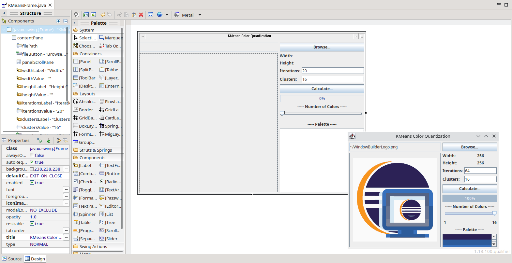

# Welcome to Eclipse WindowBuilder

 
[Pull requests](https://github.com/eclipse-windowbuilder/windowbuilder/pulls) |
[Issues](https://github.com/eclipse-windowbuilder/windowbuilder/issues)

## WindowBuilder - is a powerful and easy to use bi-directional Java GUI designer for SWT and Swing

WindowBuilder is composed of SWT Designer and Swing Designer and makes it very easy to create
Java GUI applications without spending a lot of time writing code. Use the WYSIWYG visual designer
and layout tools to create simple forms to complex windows; the Java code will be generated for you
. Easily add controls using drag-and-drop, add event handlers to your controls, change various
properties of controls using a property editor, internationalize your app and much more.

WindowBuilder is built as a plug-in to Eclipse and the various Eclipse-based IDEs
(RAD, RSA, MyEclipse, JBuilder, etc.). The plug-in builds an abstract syntax tree (AST) to navigate
the source code and uses GEF to display and manage the visual presentation.

Generated code doesn't require any additional custom libraries to compile and run: all of the
generated code can be used without having WindowBuilder installed. WindowBuilder can read and write
almost any format and reverse-engineer most hand-written Java GUI code. It also supports free-form
code editing (make changes anywhere, not just in special areas) and most user refactorings (you can
move, rename and subdivide methods without a problem). 

## Installation

Install the latest version of windowbuilder via the following update site

https://download.eclipse.org/windowbuilder/updates/nightly/latest

* 👔 Eclipse project entry: 
     * https://projects.eclipse.org/projects/tools.windowbuilder
* 🪲 Bug Tracker
     * https://github.com/eclipse-windowbuilder/windowbuilder/issues
* ⌨️ How to Contribute and get the latest snapshots: 
     * [CONTRIBUTING.md](./CONTRIBUTING.md)
* 💬 Discussion channels
     * https://github.com/eclipse-windowbuilder/windowbuilder/discussions

## How to build on the command line

WindowBuilder can be built locally with at least Java 17 and Maven 3.9.0 using:

`mvn clean package`

If the build has been successfull, then the build artifacts can be directly
consumed via the local p2 repository at:

`org.eclipse.wb.releng.updatesite/target/repository/`

If you also want to execute all tests, use the following command:

`mvn clean verify -fae`

Please note that executing the entire test suite may take between 30min and 1h,
depending on your system. Getting all tests to pass may also require a specific
screen resolution or additional fonts to be installed on your system.